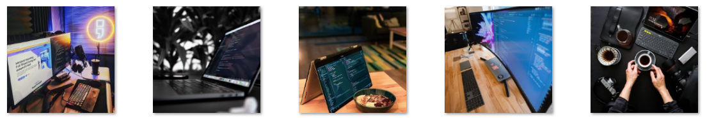

## Inspirational Image Generator

This is a short python program, I wrote to generate inspirational quotation images for a project.

The basic idea it to merge an aesthetically pleasing image with a textual image to generate an entirely new image.

**Usage**

```
python merge.py
```

### Illustration

> Background
>
> 

> Quotes
>
> 

> Merged
>
> 

I was planning to build a instagram bot to generate and post inspirational photos automatically.
